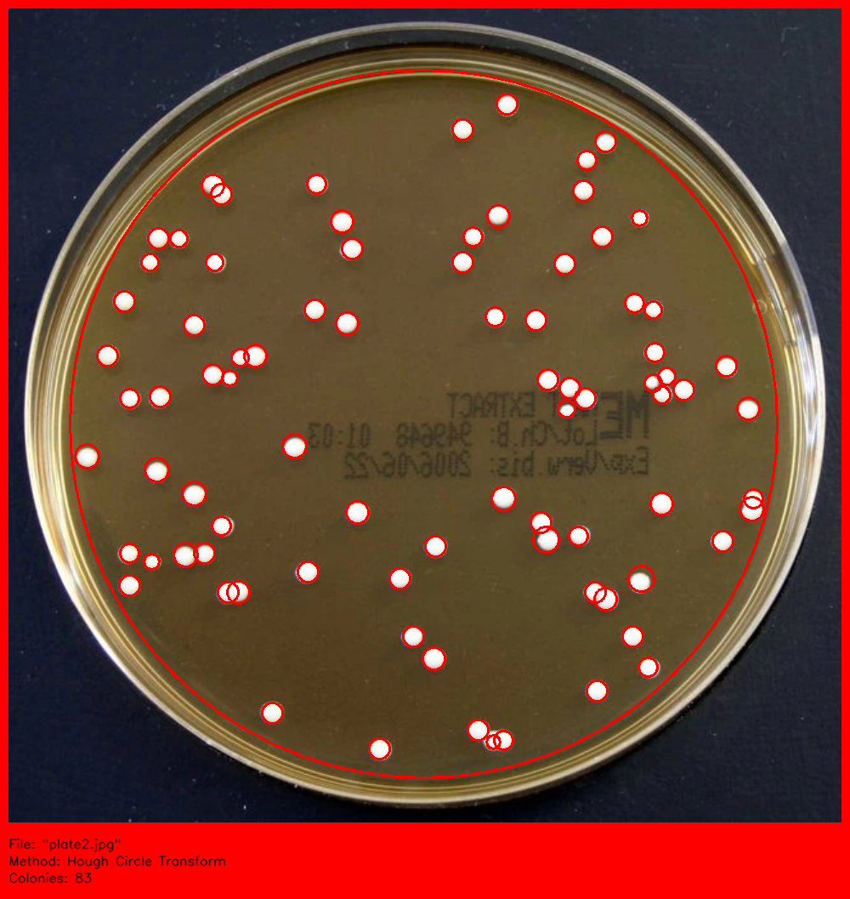
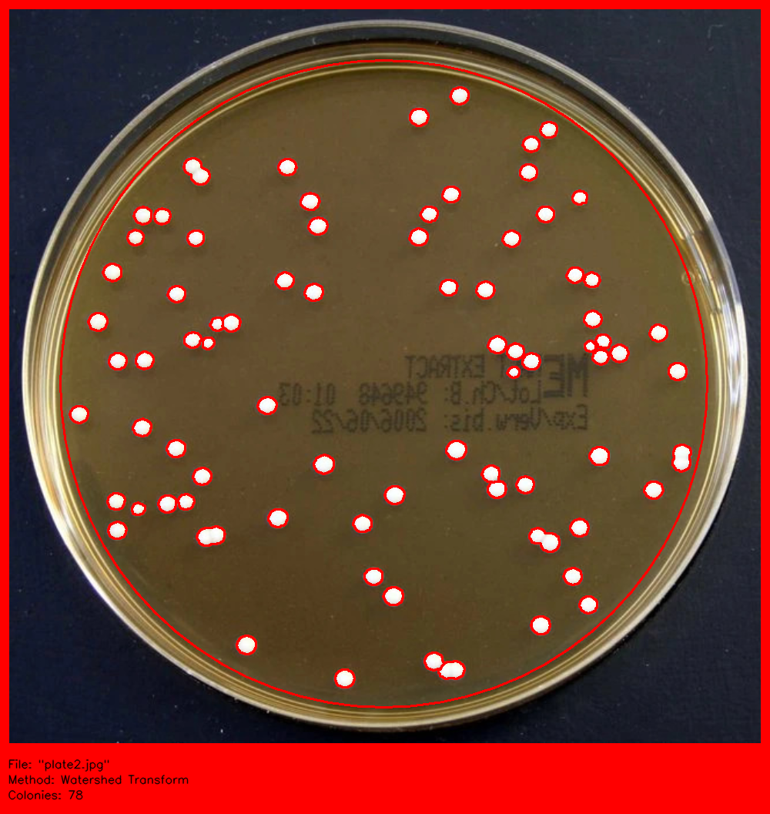

<!-- TABLE OF CONTENTS -->
<details open="open">
  <summary>Table of Contents</summary>
  <ol>
    <li>
        <a href="#about-the-project">About The Project</a>
    </li>
    <li>
      <a href="#getting-started">Getting Started</a>
      <ul>
        <li><a href="#prerequisites">Prerequisites</a></li>
        <li><a href="#usage">Usage</a></li>
      </ul>
    </li>
    <li><a href="#contact">Contact</a></li>
    <li><a href="#acknowledgements">Acknowledgements</a></li>
  </ol>
</details>


<!-- ABOUT THE PROJECT -->
## About The Project

  


This project proposes a method to aid in the enumeration of bacterial colonies present on an agar plate through use of preprocessing techniques, the Hough Circle Transform and the Watershed Transform.

This project is the main component of the COSC428: Comuter Vision paper at the university of Canterbury for 2021.


<!-- GETTING STARTED -->
## Getting Started

Once you have a local copy of the repository, place images of the agar plates in the images/ directory


## Prerequisites

This project relies on the OpenCV and numpy python libraries, so make sure you have them installed.


<!-- USAGE EXAMPLES -->
## Usage

To run the scrypt, use the following command

  ```sh
  ./counter.py <file-to-process> <method-to-use>
  ```


Currently supported methods are:
* h: Hough Circle Transform.
* w: Watershed Transform.


The input file is assumed to be in the images/ directory.


For example

  ```sh
  ./counter.py plate1.jpg h
  ```


<!-- CONTACT -->
## Contact

Kayle Ransby - krr39@uclive.ac.nz

Project Link: [https://github.com/krransby/colony-counter](https://github.com/krransby/colony-counter)


<!-- ACKNOWLEDGEMENTS -->
## Acknowledgements
* [University of Canterbury](https://www.canterbury.ac.nz/)
* [Richard Green (Supervisor)](https://www.canterbury.ac.nz/engineering/contact-us/people/richard-green.html)
* [Staphilococcus aureus colonies](http://opencfu.sourceforge.net/samples.php)
* [READEME Template](https://github.com/othneildrew/Best-README-Template)