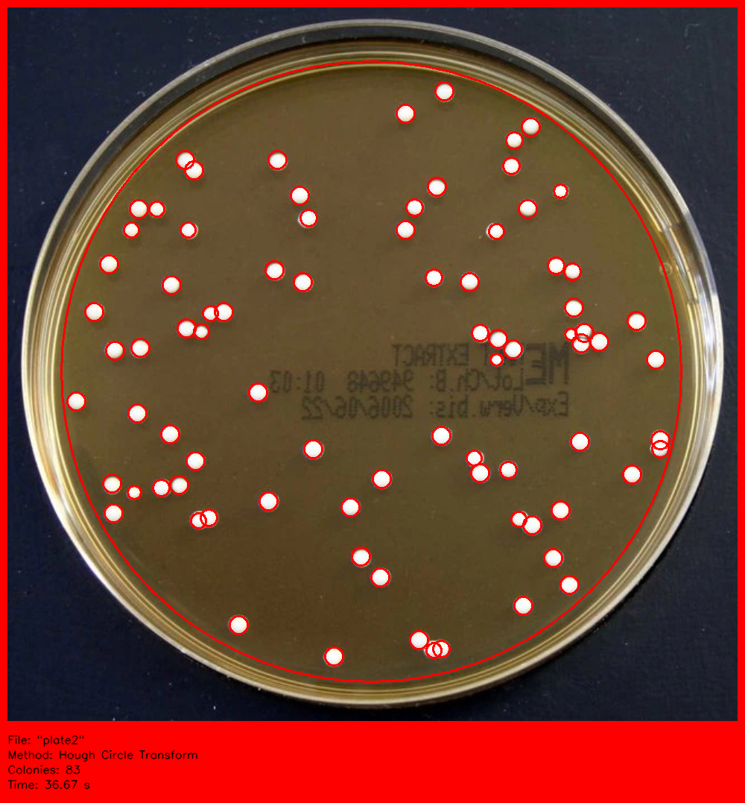
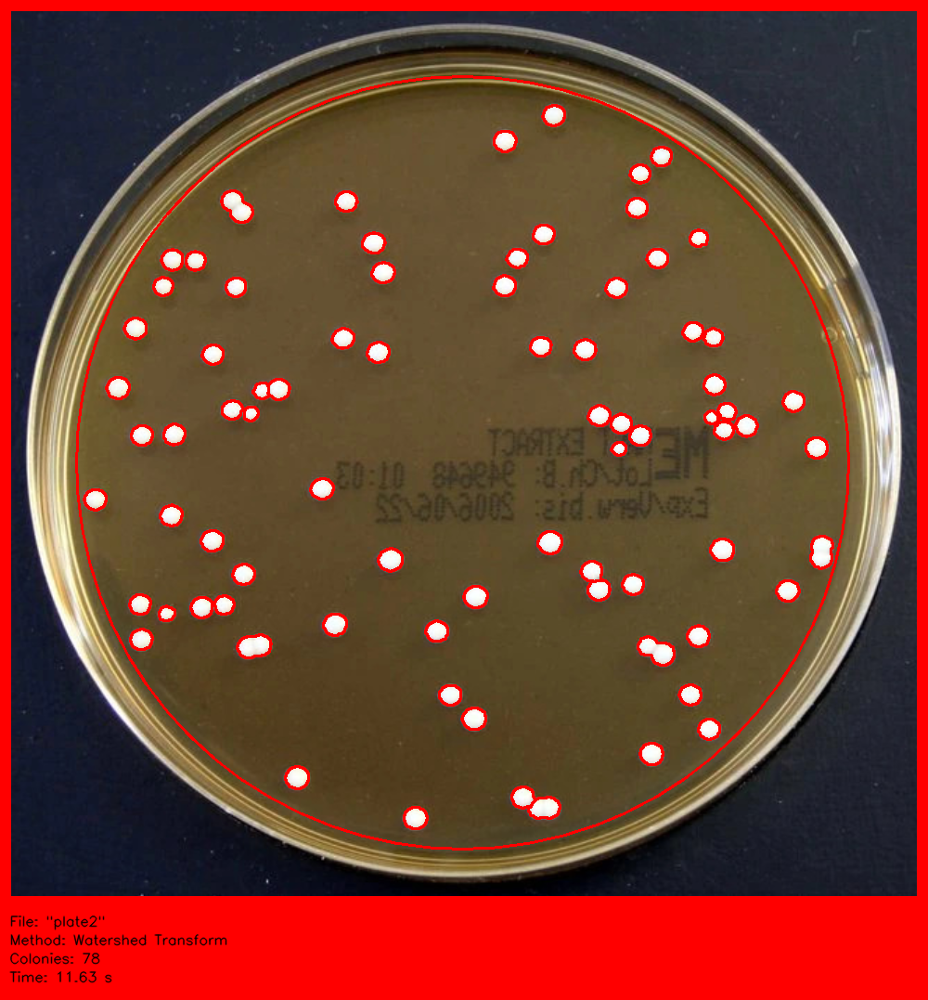

<!-- DEMO -->
<details open="open">
  <summary>Demo of the script running</summary>
   
</details>
<details>
  <summary>Script output images</summary>
   
</details>


<!-- ABOUT THE PROJECT -->
## About The Project


This repository contains the scrypt, data and outputs used in my project for the COSC428: Comuter Vision paper at the University of Canterbury (21S1).

The University of Canterbury internal paper can be found [here](#) for more context.

**TL;DR:** This project proposes a method to aid in the enumeration of bacterial colonies present on agar plates through use of preprocessing techniques, the Hough Circle Transform and the Watershed Transform.


<!-- PREREQUISITES -->
## Prerequisites

This script was written using the conda environment and relies on the OpenCV and numpy python libraries, so make sure you have them installed.


<!-- USAGE EXAMPLES -->
## Usage

Once you have a local copy of the repository, place images of the agar plates in the images/ directory

To run the scrypt, use the following command

  ```sh
  ./counter.py <input-file> <method-to-use>
  ```

The supported methods are:
* **h**: Hough Circle Transform.
* **w**: Watershed Transform.


The input file is assumed to be in the images/ directory, so you don't have to include the directory in the filename.

For example, when using *"plate1.jpg"* you don't need to run the scrypt with *images/plate1.jpg*, just *plate1.jpg*.

Like so:

  ```sh
  ./counter.py plate1.jpg h
  ```

If you'd prefer not to use the console, you can use the following call to main:

```python
if __name__ == '__main__':

    # Uncomment this line if not running through terminal,
    # only change the second and third elements
    main(['counter.py', 'plate1.jpg', 'h'])

    #main(sys.argv)
```

The script will run the same using this method, whatever is easier.


<!-- CONTACT -->
## Contact

Kayle Ransby - krr39@uclive.ac.nz

Source Code Link: [https://github.com/krransby/colony-counter](https://github.com/krransby/colony-counter)

Report Link: [Coming soon](#)


<!-- ACKNOWLEDGEMENTS -->
## Acknowledgements
* [University of Canterbury](https://www.canterbury.ac.nz/)
* [Richard Green (Supervisor)](https://www.canterbury.ac.nz/engineering/contact-us/people/richard-green.html)
* [images/HQ](http://opencfu.sourceforge.net/samples.php)
* [plate1.jpg](https://www.fishersci.se/shop/products/malt-extract-agar-contact-plate/10026782)
* [plate2.jpg](https://www.fishersci.se/shop/products/malt-extract-agar-4/10168882)
